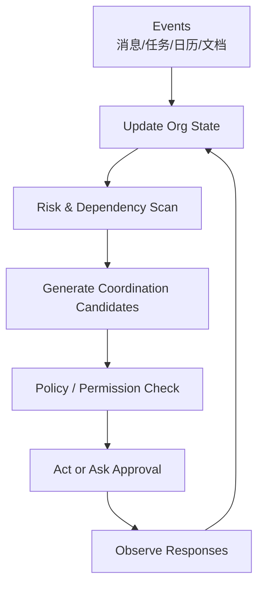

# OrgPilot 初期项目设计文档

> **副标题：** 面向多人组织协作的 Stateful Organizational Coordination Agent  
> **状态：** Draft v0.1  
> **日期：** 2026-08-26  
> **目标形态：** 可运行企业协同 Agent + 多人组织状态模型 + 飞书真实集成 + 可复现实验 + GitHub 技术叙事

## 1. 一句话定位

OrgPilot 是一个面向真实团队协作场景的长期运行 Agent：它不只回答员工问题，而是持续维护“人员、任务、依赖、承诺、阻塞、日程与组织目标”的统一状态，并通过私聊、群聊、日历、任务系统和文档工具主动协调多人工作。

它的重点不是“AI 帮忙发消息”，而是让 Agent 能回答：

> 当前团队到底处于什么状态？谁承诺了什么？哪些任务彼此依赖？哪里发生了阻塞？应该询问谁、提醒谁、协调谁、升级什么问题，才能让组织目标继续推进？

## 2. 要解决的问题

传统协作软件通常分别保存：

- 消息；
- 任务；
- 日历；
- 文档；
- 会议；
- 项目进度。

但真实团队状态并不直接存在于任何一个系统中。

例如：

```text
员工 A 私聊：
“支付 SDK 今天大概率做不完。”

任务系统：
Task #27 仍显示 In Progress。

员工 B：
正在等待 Task #27 才能开始前端联调。

日历：
周五已经安排上线评审。

项目经理：
尚未意识到延期。
```

普通聊天机器人只能回答一条消息。

OrgPilot 需要将这些离散信号统一为：

```text
支付 SDK 延期
    ↓
阻塞 Task #31
    ↓
影响周五上线
    ↓
需要重新协调 B 的任务
    ↓
需要向 PM 请求决策
```

核心问题是：

> 多人、多渠道、异步组织中的隐含状态，如何被 Agent 持续建模，并转化为可验证、可控的协同行动？

## 3. 核心工程假设

> 与单轮聊天机器人、仅依赖任务表的自动提醒器相比，显式维护组织状态图、承诺与依赖关系，并采用事件驱动的协调策略，可以更早发现阻塞、减少失效提醒、提高任务状态一致性，并降低人工项目经理对重复同步工作的负担。

首版不声称“AI 可以替代管理者”。

首版只验证：

1. Agent 能否更完整地恢复团队当前状态；
2. 能否正确识别跨人员依赖与风险；
3. 能否选择合适的协调动作；
4. 能否在多人反馈后更新状态，而不是继续执行过时计划；
5. 能否在高影响操作前正确请求人工批准。

## 4. 为什么它不是一个飞书机器人

飞书只是首个真实交互入口，不是项目本体。

OrgPilot 的独有资产包括：

| 独有资产 | 作用 |
| --- | --- |
| Organizational State Graph | 维护人员、任务、依赖、承诺、阻塞、决策和目标 |
| Commitment Ledger | 记录“谁在什么时候承诺了什么”，并追踪状态变化 |
| Dependency Model | 识别任务、人、资源和截止时间之间的依赖 |
| Coordination Policy | 决定何时询问、提醒、升级、重新分配或保持沉默 |
| Collaboration Adapter | 抽象飞书 / 企业微信 / Slack / Teams |
| Human Approval Layer | 对任务重分配、会议变更、公开通知等高影响动作请求批准 |
| Coordination Benchmark | 评估状态恢复、风险发现、行动选择和多人协同闭环 |

如果未来更换成企业微信、Slack 或 Teams，核心组织状态和协调机制不应重写。

## 5. 目标用户与首个场景

### 5.1 长期目标用户

- 5–30 人研发团队；
- 产品 / 研发 / 设计跨职能小组；
- 需要频繁同步状态的项目团队；
- 多项目并行、任务依赖复杂的组织。

### 5.2 MVP 场景

首版选择“软件研发项目协同”。

参与角色：

- 1 名 PM；
- 2 名后端；
- 2 名前端；
- 1 名测试；
- 1 名设计。

系统：

- 飞书消息；
- 飞书日历；
- 飞书多维表格或项目任务表；
- 飞书文档；
- 一个本地可控的任务/项目状态服务。

典型任务：

1. 收集每个人的进度；
2. 识别阻塞和依赖；
3. 对延期进行影响分析；
4. 主动向相关成员询问；
5. 提议重新分配或调整时间；
6. 请求 PM 批准；
7. 更新任务状态；
8. 发送同步消息；
9. 生成每日/每周项目摘要。

## 6. 非目标

MVP 明确不做：

- 不把 Agent 定义为“AI 老板”；
- 不进行绩效评价、薪酬判断、招聘或解雇；
- 不自动做高影响人事决策；
- 不读取与项目无关的私人聊天；
- 不做情绪识别或人格分析；
- 不从第一天支持所有企业协作平台；
- 不使用“多 Agent 角色扮演”冒充多人协作；
- 不让 LLM 直接成为任务数据库的唯一事实来源；
- 不在没有批准的情况下自动重排关键任务或发送正式公告。

## 7. 核心状态模型

### 7.1 人员状态

```python
class MemberState(BaseModel):
    member_id: str
    role: str
    active_tasks: list[str]
    declared_blockers: list[str]
    current_capacity: float
    commitments: list[str]
    last_update_at: datetime
    confidence: float
```

### 7.2 任务状态

```python
class TaskState(BaseModel):
    task_id: str
    title: str
    owner_id: str
    status: Literal["todo", "doing", "blocked", "review", "done"]
    deadline: datetime | None
    dependencies: list[str]
    blockers: list[str]
    required_members: list[str]
    risk_level: Literal["low", "medium", "high"]
    source_refs: list[str]
```

### 7.3 承诺

```python
class Commitment(BaseModel):
    commitment_id: str
    actor_id: str
    object_type: Literal["task", "decision", "meeting", "delivery"]
    object_id: str
    promised_state: str
    due_at: datetime | None
    source_event_id: str
    status: Literal["active", "fulfilled", "at_risk", "broken", "superseded"]
    confidence: float
```

### 7.4 组织事件

```python
class OrgEvent(BaseModel):
    event_id: str
    source: Literal["message", "task", "calendar", "document", "human"]
    actor_id: str | None
    timestamp: datetime
    content: str
    extracted_facts: dict
    affected_entities: list[str]
```

### 7.5 协调动作

```python
class CoordinationAction(BaseModel):
    action_type: Literal[
        "ask", "remind", "summarize", "escalate",
        "propose_reschedule", "propose_reassign",
        "update_task", "schedule_meeting", "notify_group"
    ]
    targets: list[str]
    reason_refs: list[str]
    expected_effect: str
    risk_level: Literal["low", "medium", "high"]
    requires_approval: bool
```

## 8. Organizational State Graph

图中主要节点：

```text
Goal
Task
Member
Commitment
Blocker
Decision
Meeting
Artifact
```

主要边：

```text
Member --owns--> Task
Task --depends_on--> Task
Blocker --blocks--> Task
Commitment --promises--> Task
Task --supports--> Goal
Decision --changes--> Task
Meeting --reviews--> Task
Artifact --evidence_for--> Decision
```

OrgPilot 不直接把聊天记录当作“真相”。

聊天只是事件来源之一。

统一状态必须经过：

```text
Event
  ↓
Fact extraction
  ↓
Entity resolution
  ↓
Conflict detection
  ↓
State update
  ↓
Confidence / provenance
```

## 9. Agent 执行循环



每次循环：

1. 拉取或接收新事件；
2. 更新成员、任务、承诺和依赖状态；
3. 检测冲突、阻塞、延期和缺失信息；
4. 对每个问题生成多个协调动作；
5. 依据风险、打扰成本、紧迫度和权限排序；
6. 低风险动作自动执行；
7. 高影响动作生成预览并等待人工批准；
8. 收集成员反馈；
9. 更新组织状态；
10. 判断问题是否关闭或需要升级。

## 10. 协调策略

首版使用可解释评分：

\[
Score(a) =
w_u Urgency +
w_i Impact +
w_c Confidence -
w_d Disturbance -
w_r Risk
\]

其中：

- `Urgency`：距离 deadline；
- `Impact`：受影响的任务/成员数量；
- `Confidence`：当前事实是否足够确定；
- `Disturbance`：是否会无意义打扰成员；
- `Risk`：操作是否改变正式计划或对外发送消息。

目标不是“越主动越好”。

一个优秀的组织 Agent 必须学会：

> 什么时候不说话。

## 11. 运行模式

### 11.1 Observe Mode

只维护组织状态，不主动发消息。

用途：

- 建立 baseline；
- 验证状态恢复；
- 低风险试运行。

### 11.2 Assist Mode

允许：

- 私聊询问；
- 提醒；
- 生成摘要；
- 提出调整建议。

正式修改需要审批。

### 11.3 Coordinated Mode

在明确权限范围内允许：

- 更新任务；
- 创建会议；
- 通知相关成员；
- 自动执行已批准的协调计划。

## 12. Collaboration Adapter

```python
class CollaborationAdapter(Protocol):
    async def list_members(self) -> list[Member]: ...
    async def read_messages(self, cursor: str | None) -> list[MessageEvent]: ...
    async def send_message(self, target: str, content: str) -> SendResult: ...
    async def list_calendar_events(self, member_id: str) -> list[CalendarEvent]: ...
    async def create_calendar_event(self, event: CalendarEvent) -> str: ...
    async def list_tasks(self) -> list[ExternalTask]: ...
    async def update_task(self, task_id: str, patch: dict) -> None: ...
```

首版：

- `FeishuAdapter`
- `MockCollaborationAdapter`

后续：

- `WeComAdapter`
- `SlackAdapter`
- `TeamsAdapter`

## 13. 系统架构

| 模块 | 职责 | MVP 实现建议 |
| --- | --- | --- |
| Event Gateway | 接收消息、任务、日历事件 | FastAPI + Webhook |
| Collaboration Adapter | 适配飞书等平台 | Feishu Open API |
| Identity Resolver | 用户与组织身份映射 | PostgreSQL |
| Org State Store | 保存任务、成员、承诺、依赖 | PostgreSQL |
| Event Log | Append-only 组织事件 | PostgreSQL |
| State Updater | 从事件更新统一状态 | 规则 + 结构化 LLM |
| Dependency Engine | 计算任务与人员影响关系 | 图查询 / 邻接表 |
| Coordination Planner | 生成候选协调动作 | 自定义单 Agent Loop |
| Policy Engine | 权限、打扰、风险和审批 | Rule-first |
| Executor | 发消息、改任务、建会议 | Adapter |
| Human Approval | 高影响操作预览与批准 | Web / 飞书卡片 |
| Evaluator | 场景回放和指标 | pytest + eval CLI |
| Observability | Trace、成本、决策路径 | OpenTelemetry-compatible events |

## 14. MVP 范围

### 14.1 必须完成

- 飞书真实机器人 / 自建应用接入；
- 5–7 名模拟团队成员；
- 任务、依赖、承诺和阻塞状态；
- 事件驱动状态更新；
- 主动私聊询问；
- 阻塞传播分析；
- 协调动作候选与策略评分；
- Human Approval；
- 自动更新任务和日历；
- 每日项目摘要；
- 可重复场景 benchmark；
- 完整 Trace 与 Replay。

### 14.2 建议目标规模

以下为目标，不是已取得结果：

- 30 个模拟项目场景；
- 100+ 组织事件；
- 50+ 任务；
- 20+ dependency edges；
- 5 类风险：延期、阻塞、冲突、容量不足、计划变更；
- 每个系统配置至少运行 3 次。

## 15. 评测设计

### 15.1 对比系统

| 编号 | 系统 |
| --- | --- |
| B0 | 无 Agent，仅任务系统 |
| B1 | Chatbot：只响应消息 |
| B2 | Reminder Bot：基于 deadline 的规则提醒 |
| B3 | State-only Agent：维护组织状态但不做依赖传播 |
| O | OrgPilot 完整系统 |

### 15.2 核心指标

| 指标 | 定义 |
| --- | --- |
| Org State Accuracy | 对任务、成员、承诺状态的恢复准确率 |
| Blocker Recall | 真正阻塞中被发现的比例 |
| Impact Recall | 延期后正确识别受影响任务的比例 |
| Coordination Success | 协调后问题得到关闭的比例 |
| False Reminder Rate | 不必要提醒占比 |
| Time-to-Detect | 风险发生到系统识别的时间 |
| Human Override Rate | 人工否决动作的比例 |
| Approval Precision | 高影响动作是否正确触发审批 |
| Message Cost | 每关闭一个问题发送的消息数量 |
| LLM Cost / Latency | 每场景模型调用与耗时 |

### 15.3 必做消融

- 去掉承诺模型；
- 去掉依赖图；
- 去掉成员容量；
- 去掉主动询问；
- 去掉风险策略，允许 Agent 自主决定；
- 仅使用任务系统，不读取消息；
- 仅使用消息，不读取任务系统。

## 16. Ground Truth 场景

首版不依赖真实公司数据做 benchmark。

每个场景使用事件脚本：

```yaml
members:
  - alice
  - bob

tasks:
  - id: backend_api
    owner: alice
    deadline: 2026-09-10
  - id: frontend_integration
    owner: bob
    depends_on: [backend_api]

events:
  - t: 09:00
    actor: alice
    message: "API 今天完不成，SDK 还没调通。"
```

Ground Truth 声明：

- `backend_api = at_risk`
- `frontend_integration = impacted`
- 应询问 Alice 的预计恢复时间；
- 不应立即公开升级；
- 如果预计延期超过阈值，应请求 PM 批准改计划。

## 17. Security & Privacy

企业协同 Agent 的安全性必须是项目主线之一。

- 最小权限；
- 所有外部消息默认是不可信输入；
- Prompt Injection 不得改变系统权限；
- 不读取非项目相关私聊；
- 高影响动作需要批准；
- 不自动评价员工绩效；
- 支持审计日志；
- 支持撤销可逆操作；
- Token / Secret 与业务数据隔离；
- Trace 中脱敏私人内容；
- Member 数据按租户隔离。

## 18. Repository 结构

```text
orgpilot/
├── README.md
├── pyproject.toml
├── src/orgpilot/
│   ├── domain/
│   ├── events/
│   ├── state/
│   ├── commitments/
│   ├── dependencies/
│   ├── planning/
│   ├── policy/
│   ├── execution/
│   ├── approvals/
│   ├── adapters/
│   │   ├── feishu/
│   │   └── mock/
│   ├── providers/
│   └── observability/
├── evals/
│   ├── scenarios/
│   ├── baselines/
│   └── reports/
├── apps/
│   ├── api/
│   └── dashboard/
├── tests/
├── docs/
│   ├── architecture.md
│   ├── benchmark.md
│   ├── privacy.md
│   └── threat-model.md
└── examples/
```

## 19. 里程碑

### P0：组织状态机制验证（3–5天）

- 不接飞书；
- 构造 5 名成员、8 个任务、10 条事件；
- 只实现 Event → Org State → Dependency Impact；
- 注入一个延期；
- 证明系统能找到受影响任务。

**通过条件：**
不能只生成“总结”，必须输出可程序验证的状态变化。

### M1：可运行 MVP（第1–2周）

- Mock Adapter；
- Event Log；
- Org State；
- Commitment Ledger；
- Dependency Engine；
- 20 个场景；
- CLI demo。

### M2：飞书真实接入（第3–4周）

- 飞书机器人；
- 私聊 / 群消息；
- 多维表格；
- 日历；
- Approval Card；
- 真实端到端 demo。

### M3：协调 Agent 与评测（第5–6周）

- 主动询问；
- 协调策略；
- baselines；
- benchmark；
- failure analysis；
- Trace viewer。

### M4：GitHub 发布（第7周）

- README；
- 架构文档；
- benchmark；
- 安全文档；
- 视频 demo；
- 可复现 release。

## 20. 风险与终止条件

| 风险 | 验证 | 调整 |
| --- | --- | --- |
| 只是飞书机器人 | Mock Adapter 下也能完整运行 | 把平台逻辑继续下沉到 adapter |
| 组织状态主要靠 prompt 猜 | 与 ground truth 对比 | 增强结构化状态与来源 |
| 主动提醒过度 | False Reminder Rate | 增加 Disturbance 成本 |
| 私聊造成隐私问题 | 最小数据范围 | 严格项目域限制 |
| Agent 行动越多越差 | 对比 Assist / Coordinated | 降低自治范围 |
| Human Approval 形同虚设 | 统计 override | 重做风险分类 |

### 项目终止条件

满足任一条件时需要重构：

- Org State Accuracy 不优于简单任务表；
- Dependency Engine 无法提高阻塞发现；
- 协调动作导致更多人工纠错；
- 平台 API 成为项目 80% 以上工作量；
- 项目无法脱离飞书单独运行。

## 21. GitHub 首页应展示什么

README 首屏：

1. **问题：** 团队真实状态散落在消息、任务、日历和承诺中；
2. **机制：** Organizational State Graph + Commitment Ledger + Dependency-aware Coordination；
3. **证据：** 与 Chatbot / Reminder Bot / State-only Agent 的 benchmark；
4. **体验：** 一段“员工报告延期 → 自动发现影响 → 询问相关人 → 请求 PM 批准 → 更新任务与日历”的端到端 Trace。

不要把“接入飞书API”当作主创新。

## 22. 面试叙事

推荐的 30 秒表达：

> 我做了一个面向多人研发团队的长期协同 Agent。它不是普通飞书机器人，而是把消息、任务、日历和成员承诺统一成组织状态图，持续维护任务依赖和风险。当某个成员报告延期时，系统会计算影响范围，决定应该询问谁、是否需要升级、是否应该调整任务，并对高影响动作请求人工批准。我还构建了可回放的多人协作 benchmark，对比普通 Chatbot、规则提醒和只维护任务状态的 Agent，重点测组织状态准确率、阻塞召回、错误提醒和协调成功率。

## 23. 第一周任务清单

- [ ] 定义 `MemberState`、`TaskState`、`Commitment`、`OrgEvent`；
- [ ] 定义 5 名模拟成员；
- [ ] 建立 8 个任务和 6 条依赖；
- [ ] 编写 10 条事件；
- [ ] 实现 Append-only Event Log；
- [ ] 实现 Org State Updater；
- [ ] 实现 Dependency Impact；
- [ ] 输出第一张 ground truth 对比表；
- [ ] 若无法稳定恢复状态，不进入飞书接入。

## 24. 当前待决策项

1. 飞书任务使用多维表格还是飞书项目 API；
2. 首版主动协调只允许私聊，还是允许群通知；
3. Org State Store 使用 PostgreSQL 邻接表还是单独引入图数据库；
4. 日历访问是否只读取模拟成员，真实 demo 使用单独测试账号；
5. 是否在 M3 增加 Slack Adapter，验证平台无关性。
